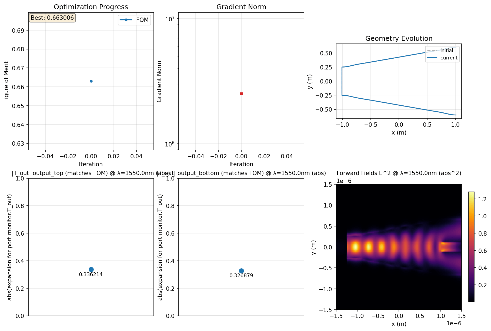

# Y-Branch-Inverse-Design

Inverse Design example ported to LumOpt2 using Lumerical MCP

A port of the Lumerical [Y-branch Inverse Design example](https://optics.ansys.com/hc/en-us/articles/360042305274-Inverse-design-of-y-branch) to Lumerical's newest optimization library, [LumOpt2](https://optics.ansys.com/hc/en-us/articles/52491455777171-Lumerical-inverse-design-module-lumopt2) using [Lumerical MCP](https://lumerical-mcp.docs.pyansys.com/version/stable/index.html).

## Requirements

* Python 3
* Lumerical FDTD
* PyLumerical
* SciPy
* NumPy

## How to Use

Run `y_branch_opt_2D_lumopt2.py` and the optimization will run to completion (maximum 30 iterations by default). Upon completion, 2 files will be created. The first is `y_branch_2D_lumopt2_INITIAL.fsp` which is the starting design. The second is `y_branch_2D_lumopt2_FINAL.fsp` which is the final optimized design.

A folder for the optimization process will be generated as well with the raw files used in the iterations.

Inside the folder there is a subfolder named `process plot` which saves the plots for each iteration.

## Results

